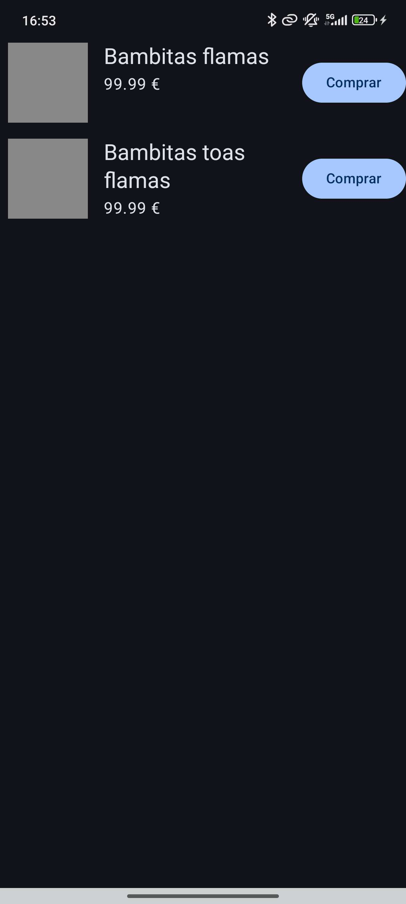
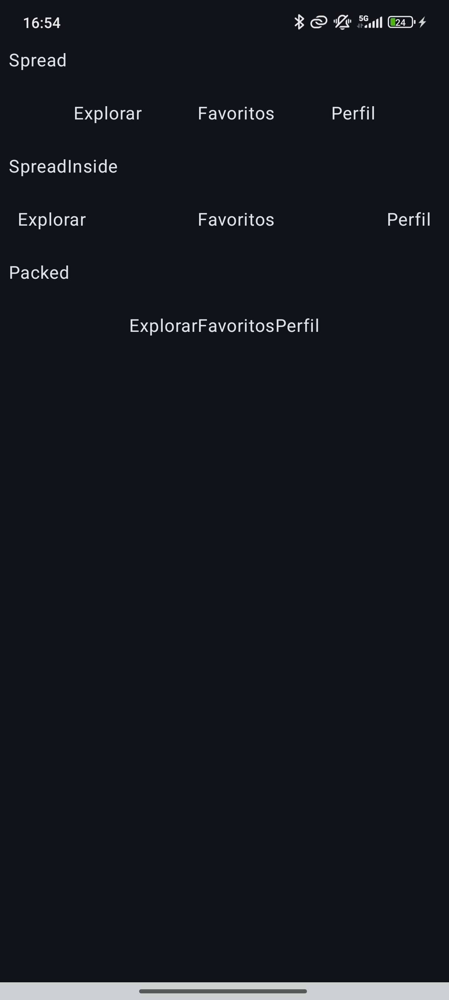
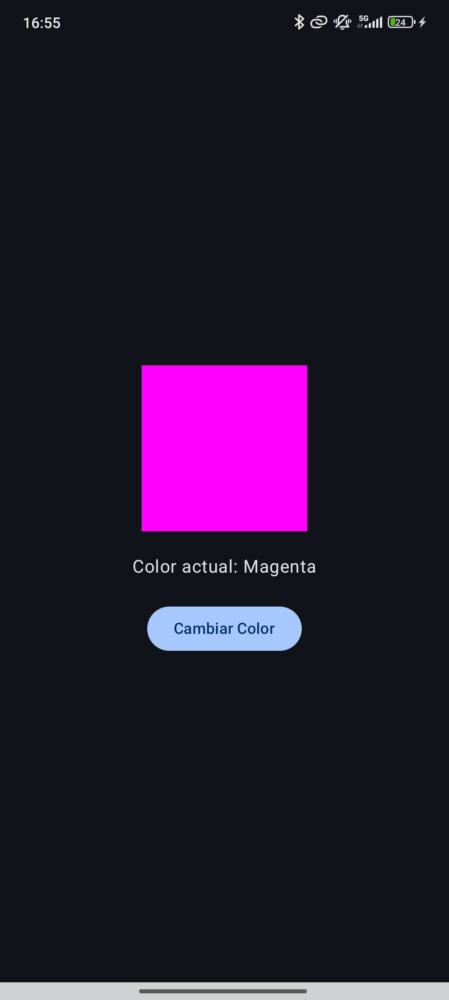
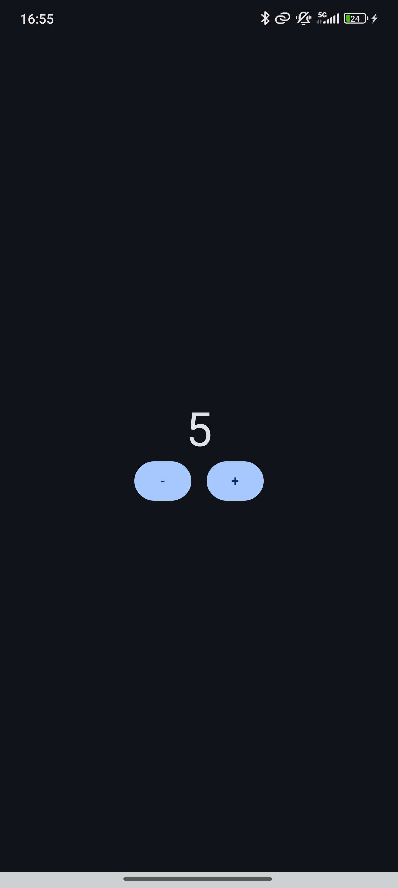
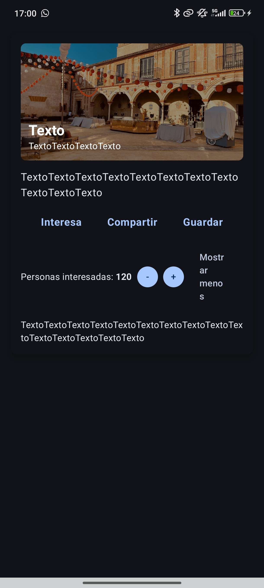

# Práctica de Jetpack Compose: Layouts y Gestión de Estado

***Nombre del alumno***:  
José Luis Salado Horta  

***Asignatura***:  
Desarrollo de Interfaces  

***Profesor/a:***  
Fernando Macías Ramos  

***Fecha de entrega:***  
23 de octubre de 2025  

---

## Índice

1. [Objetivo de la Práctica](#objetivo-de-la-práctica)  
2. [Ejercicios Resueltos](#ejercicios-resueltos)  
   - [Ejercicio 1: Ficha de producto con texto variable (Barreras)](#ejercicio-1--ficha-de-producto-con-texto-variable-barreras)  
   - [Ejercicio 2: Acciones principales en una barra (Cadenas)](#ejercicio-2--acciones-principales-en-una-barra-cadenas)  
   - [Ejercicio 3: Cambiando colores con estado](#ejercicio-3--cambiando-colores-con-estado)  
   - [Ejercicio 4: Contador doble con lógica condicional](#ejercicio-4--contador-doble-con-lógica-condicional)  
   - [Ejercicio 5: Interruptor de visibilidad](#ejercicio-5--interruptor-de-visibilidad)  
3. [Ejercicio Extra: Tarjeta de Evento Interactiva](#ejercicio-extra--tarjeta-de-evento-interactiva)  
4. [Tecnologías y Conceptos Clave](#tecnologías-y-conceptos-clave)  

---

## Objetivo de la Práctica

El objetivo principal de esta práctica es aplicar conceptos avanzados de ConstraintLayout en Jetpack Compose, como barreras (barriers) y cadenas (chains), junto con una sólida gestión de estado.  

El fin es resolver escenarios comunes en el desarrollo de interfaces de usuario modernas:  
- Crear alineaciones que dependen dinámicamente de la longitud del contenido.  
- Distribuir elementos de forma equilibrada y responsiva.  
- Gestionar y persistir datos en la UI ante recomposiciones y cambios de configuración (como la rotación del dispositivo).  

---

## Ejercicios Resueltos

### Ejercicio 1 – Ficha de producto con texto variable (Barreras)

**Enunciado**  
Diseña una tarjeta de producto con: imagen, título (longitud variable), precio y un botón “Comprar”.

- El botón debe alinearse a la derecha de una barrera creada con el título y el precio, de forma que nunca se solape aunque el título sea largo.  
- Pide un margen uniforme entre el grupo de texto y el botón.  
- Comprueba con títulos cortos y largos que la alineación se mantiene.  

**Fragmento clave del código**  
Aquí va un permalink.

**Previsualización**  
```kotlin
@Preview(showBackground = true)
@Composable
fun ProductCardPreview() {
    Column {
        ProductCard(title = "Producto corto")
        ProductCard(title = "Producto con un título mucho más largo")
    }
}
```



---

### Ejercicio 2 – Acciones principales en una barra (Cadenas)

**Enunciado**  
Crea una barra con tres acciones (solo texto, sin iconos): por ejemplo “Explorar”, “Favoritos”, “Perfil”.

- Colócalas en una cadena horizontal y prueba tres estilos: Spread, SpreadInside y Packed.  
- Justifica cuál elegirías para una barra de navegación inferior y por qué mejora la usabilidad.  

**Fragmento clave del código**  
Aquí va un permalink.

**Previsualización**  
```kotlin
@Composable
fun BarraEstilos() {
    Column {
        Text("Spread", modifier = Modifier.padding(8.dp))
        BarraSinEstilos(chainStyle = ChainStyle.Spread)

        Text("SpreadInside", modifier = Modifier.padding(8.dp))
        BarraSinEstilos(chainStyle = ChainStyle.SpreadInside)

        Text("Packed", modifier = Modifier.padding(8.dp))
        BarraSinEstilos(chainStyle = ChainStyle.Packed)
    }
}

@Preview(showBackground = true)
@Composable
fun BarraEstilosPreview() {
    BarraEstilos()
}
```



---

### Ejercicio 3 – Cambiando colores con estado

**Enunciado**  
Crea una pantalla con un botón y un cuadro de color (`Box`).  

- Cada vez que pulses el botón, el color del cuadro debe cambiar aleatoriamente entre varios colores (por ejemplo, rojo, verde, azul o amarillo).  
- Muestra también el nombre del color actual en un texto.  

**Fragmento clave del código**  
Aquí va un permalink.

**Previsualización**  
```kotlin
@Preview(showBackground = true)
@Composable
fun PantallaColoresPreview() {
    PantallaColores()
}
```



---

### Ejercicio 4 – Contador doble con lógica condicional

**Enunciado**  
Crea una vista con dos botones: uno que sume y otro que reste un valor.  

- El valor actual se muestra en el centro de la pantalla.  
- El botón de restar debe deshabilitarse si el contador llega a 0.  

**Fragmento clave del código**  
Aquí va un permalink.

**Previsualización**  
```kotlin
@Preview(showBackground = true)
@Composable
fun PantallaContadorPreview() {
    PantallaContador()
}
```



---

### Ejercicio 5 – Interruptor de visibilidad

**Enunciado**  
Crea una pantalla con un texto y un botón que permita mostrar u ocultar ese texto.  

- El botón debe cambiar su etiqueta según el estado actual (“Mostrar texto” / “Ocultar texto”).  
- El texto solo debe renderizarse cuando el estado sea “visible”.  

**Fragmento clave del código**  
Aquí va un permalink.

**Previsualización**  
```kotlin
@Preview(showBackground = true)
@Composable
fun PantallaTextoVisiblePreview() {
    PantallaTextoVisible()
}
```


---

### Ejercicio Extra – Tarjeta de Evento Interactiva

**Enunciado**  
Diseña una tarjeta de evento que sea visualmente atractiva y funcionalmente robusta.  

- **Cabecera visual:** Muestra una imagen del evento con título y subtítulo/fecha. Los textos deben adaptarse a longitudes variables sin solaparse.  
- **Cuerpo:** Incluye una descripción y una fila de acciones ("Interesa", "Compartir", "Guardar") distribuidas horizontalmente.  
- **Pie interactivo:** Contador de "Personas interesadas" con botones para incrementar/decrementar y un botón "Mostrar más / Mostrar menos" que alterna la visibilidad de una descripción secundaria.  

**Fragmento clave del código**  
Aquí va un permalink.

**Previsualización**  
```kotlin
@Preview(
    name = "Tarjeta con texto corto",
    showBackground = true,
    backgroundColor = 0xFFF0F0F0,
    widthDp = 360
)
@Composable
fun EventCardPreview_TextoCorto() {
    PracticaEstadosTheme {
        EventCard(
            titulo = "Evento corto",
            subtitulo = "Subtítulo corto",
            descripcion = "Descripción breve del evento.",
            descripcionSecundaria = "Detalles adicionales del evento."
        )
    }
}

@Preview(
    name = "Tarjeta con texto largo",
    showBackground = true,
    backgroundColor = 0xFFF0F0F0,
    widthDp = 480
)
@Composable
fun EventCardPreview_TextoLargo() {
    PracticaEstadosTheme {
        EventCard(
            titulo = "Evento con un título muy largo que ocupa varias líneas",
            subtitulo = "Subtítulo también largo",
            descripcion = "Descripción extensa del evento que ocupa varias líneas para probar el diseño y la distribución de los elementos en la tarjeta.",
            descripcionSecundaria = "Detalles adicionales del evento que se muestran al expandir la tarjeta."
        )
    }
}
```



---

## 🛠️ Tecnologías y Conceptos Clave

- **Jetpack Compose:** El framework de UI declarativo y moderno de Android.  
- **ConstraintLayout en Compose:** Para la creación de layouts complejos y responsivos.  
- **Barriers:** Para alinear elementos respecto a un grupo de tamaño variable.  
- **Chains:** Para distribuir elementos en una dimensión.  
- **Gestión de Estado:**  
  - `remember`: Para mantener el estado durante las recomposiciones.  
  - `rememberSaveable`: Para persistir el estado a través de cambios de configuración.  
  - `mutableStateOf / mutableIntStateOf`: Para crear estados observables.  
- **Renderizado Condicional:** Uso de lógica `if` para añadir o quitar `Composables` del árbol de la UI.